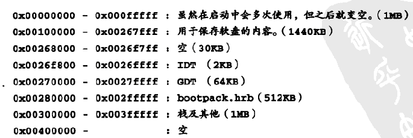

# Day 9 Memory

## refactor

拆分文件 mouse.c, keyboard.c, 修改Makefile
- https://gitee.com/paud/30daysOS/tree/master/projects/09_day/harib06a


## 检查内存容量
- https://gitee.com/paud/30daysOS/tree/master/projects/09_day/harib06b

方法1: 在启动时，通过BIOS检查内存容量. 但那样做的话，一方面asmhead.nas会变长，另一方面，BIOS版本不同，BIOS函数的调用方法也不相同


方法2: 读写内存,需要关闭cache
检查CPU是486以上还是386。如果是486以上，EFLAGS寄存器的第18位应该是所谓的AC标志位；
如果CPU是386，那么就没有这个标志位，第18位一直是0。
把1写入到这一位，然后再读出EFLAGS的值，继而检查AC标志位是否仍为1。最后，将AC标志位重置为0。

指定虚拟机可用内存
```
qemu-system-i386 -fda myos.img -boot a -m 32
```
## 用汇编改写 memtest
- https://gitee.com/paud/30daysOS/tree/master/projects/09_day/harib06c
作者, 但在我的环境里运行正常

0x400000以前的内存已经被用了(见8.5内存分布图), 


因此检测0x00400000 ~ 0xbfffffff 的3G空间
```
 unsigned int memtotal = memtest(0x00400000, 0xbfffffff);
```
## 内存管理
- https://gitee.com/paud/30daysOS/tree/master/projects/09_day/harib06d

```
struct FreeInfo {
  unsigned int addr, size;
};

struct MemMan {
  int frees, maxfrees, lostsize, losts;
  struct FreeInfo free[MEMMAN_FREES];
};
```
memman 需要32K
使用0x3c0000开始


