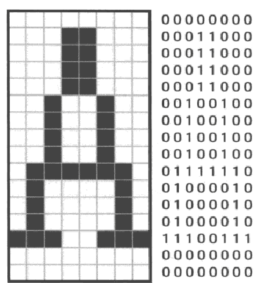

字符可以用8x16的2d array 来表示

```
	static char font_A[16] = {
		0x00, 0x18, 0x18, 0x18, 0x18, 0x24, 0x24, 0x24,
		0x24, 0x7e, 0x42, 0x42, 0x42, 0xe7, 0x00, 0x00
	};
```
static 指令用于数据，等效于DB指令, 避免被编译成赋值语句
```
  font_A:
		DB 0x00, 0x18,...
```

显示单个字符的函数
```
void putfont8(char *vram, int xsize, int x, int y, char color, char *font)
{
	// 16 rows
	for (int i = 0; i < 16; i++) {
		char *p = vram + (y + i) * xsize + x;
		char d = font[i]; // each row
    // each cell
		if ((d & 0x80) != 0) { p[0] = color; }
		if ((d & 0x40) != 0) { p[1] = color; }
		if ((d & 0x20) != 0) { p[2] = color; }
		if ((d & 0x10) != 0) { p[3] = color; }
		if ((d & 0x08) != 0) { p[4] = color; }
		if ((d & 0x04) != 0) { p[5] = color; }
		if ((d & 0x02) != 0) { p[6] = color; }
		if ((d & 0x01) != 0) { p[7] = color; }
	}
	return;
}
```

## create font file
256 个字符, 每个字符16字节, 共 256 * 16 = 4096字节
```
char hankaku[4096] = {

}
```
每个字符的对应的数据为 ASCII code * 16