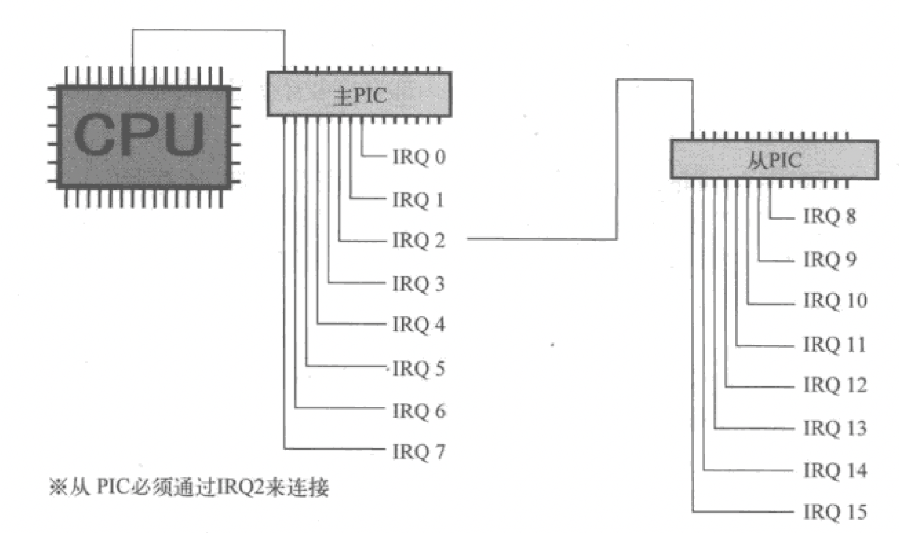

# PIC (Programmable interrupt controller)
PIC是将8个中断信号集合成一个中断信号的装置。PIC监视着输入管脚的8个中断信号，只要有一个中断信号进来，就将唯一的输出管脚信号变成ON，并通知给CPU。

与CPU直接相连的PIC称为主PIC（master PIC），与主PIC相连的PIC称为从PIC（slave PIC）。

master PIC负责处理第`0`到第`7`号中断信号，slave PIC负责处理第`8`到第`15`号中断信号
slavee PIC通过第`2`号IRQ与主PIC相连。

## 设置 PIC
从CPU的角度来看，PIC是外部设备，CPU使用OUT指令进行操作

PIC内部有很多8位寄存器，每个寄存器都有对应的端口号.

- IMR(interrupt mask register)。8位分别对应8路IRQ(interrupt request)信号。如果某一位的值是1，则该位所对应的IRQ信号被屏蔽，PIC就忽视该路信号, 在设置PIC时要屏蔽所有中断

- ICW(initial control word) 有 4个
  ICW1和ICW4 取值固定
  
  ICW3是有关主—从连接的设定，
  对主PIC而言，设定成00000100, 表示 IRQ2 与从PIC相连
  对从PIC来说，该从PIC与主PIC的第几号相连，设定为2。
  
  ICW2，决定了IRQ以哪一号中断通知CPU, 
  CPU 内部已经使用了中断号 0x0 ~ 0x1F
  IRQ0-7 is received by INT20-27, IRQ8-15 is received by INT28-2f

init_pc.c
io_out.asm

