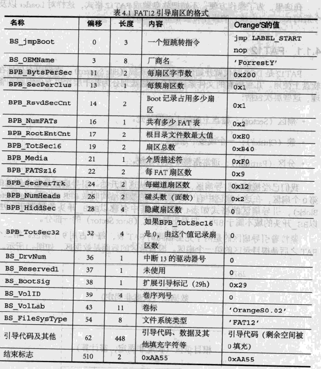

## 用ASM 写 initial program loader（IPL）

在asm代码直接包含了FAT12文件系统信息

计算机读写软盘的时候，并不是一个字节一个字节地读写的，而是以512字节为一个单位进行读写。因此，软盘的512字节就称为一个扇区。
一张软盘的空间共有1440KB，也就是1474560字节，除以512得2880，这也就是说一张软盘共有2880个扇区。

如果第一个扇区最后2个字最后两个字节正好是0x55 AA，那它就认为这个扇区的开头是启动程序，并开始执行这个程序。

业界标准规定 boot section 的512 字节要被加载到内存的  0x7c00 ~ 0x7dff

这就是汇编代码 `ORG    0x7C00` 的原因

Complie the boot.nas
```
  z_tools\nask.exe ipl.nas ipl.bin ipl.lst
```
列表文件ipl.lst是一个文本文件，可以用来简单地确认每个指令是怎样翻译成机器语言的。


- [用java做操作系统内核：软盘读写](https://blog.csdn.net/tyler_download/article/details/51815483)
- [](https://www.bilibili.com/video/BV1hJ411n7rs?p=3)


- [java开发操作系统内核：让内核突破512字节的限制](https://blog.csdn.net/tyler_download/article/details/51970921)


## Java App
- read file and write it to the second sector of the flppy disk image


## NASM
- loader.bin
位于 Cylinder 0 - Head 0 - Sector1
load kernel from sector 2 to 0x8000 and execute.

- kernel.bin
位于 Cylinder 0 - Head 0 - Sector2


## 寻址
MOV AL, [ES:BX]    ; ES*16+BX  
Address is 2^20 = 1M

DS is the default Segment Register
MOV CX,[1234]  
equals to 
MOV CX,[DS:1234]  


让 loader 加载 kernel有两种做法
1. 不依赖FAT12文件系统
loader.asm 不包含 FAT 12 文件信息，用 java app 把 loader.bin写入第一个sector，
并在0x510处写上0x55AA，把第一个sector标记为启动扇区。
loader启动后会把kernel加载到0x8000，然后执行

kernel.asm中程序运行的地址为org   0x8000，用java app 把 kernel.bin写入第2扇区

2. 使用FAT12，《30天自制操作系统》day 3使用这种方法， 这种方法易与管理文件
FAT12对引导扇区的格式有规定


loader.asm 包含 FAT12信息以及 0x55AA 标记，用 dd 命令把loader.bin写入第一个sector
把kernel.bin作为文件copy到disk的文件系统中
P55: 向一个空floppy disk写入文件时，文件名会出现在磁盘0x2600
文件内容会出现在磁盘0x4200.

因为根目录区从19扇区开始，每个扇区512bytes，因此根目录下第一个文件的目录信息开始于19*512 = 0x2600
数据区开始扇区号 = 根目录开始扇区号+ 目录所占区号 = 19 + 14 = 33
第一个文件的起始位置在 512 * 33 = 0x4200

因为loader会把disk上从C0-H0-S2开始到内容加载到0x8200，C0-H0-S1启动扇区会被加载到0x8000
所以磁盘0x4200的内容会被加载到内存0x8000+0x4200 = 0xc200的位置。
因此kernel.asm中 org 应为 0xc2000， loader中最后要jmp到0xc2000 开始执行


